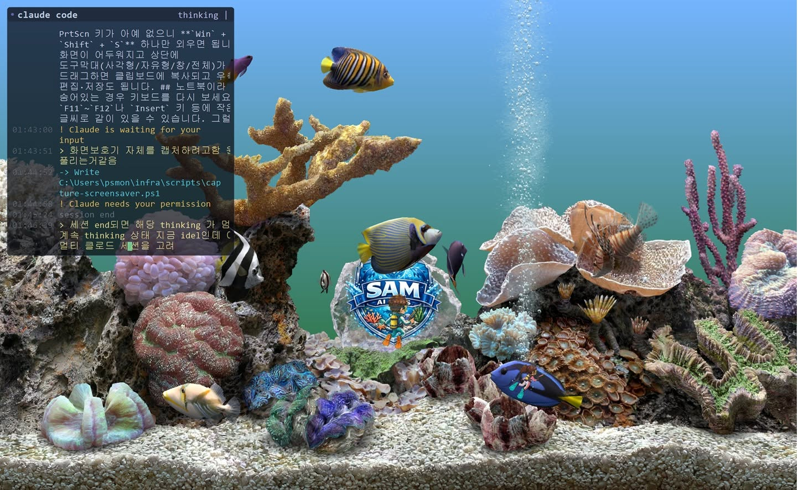
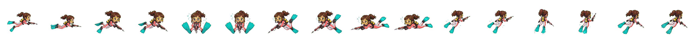
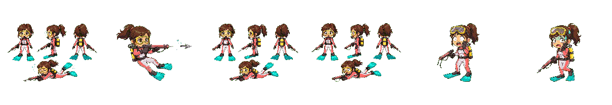

# Screensaver Overlay (화면보호기 오버레이)

<p align="right"><a href="README.md">English</a> · <b>한국어</b></p>

<p align="center">
  
</p>

<p align="center">
  <b>당신의 화면보호기를, 오버레이로 살아 움직이게.</b><br>
  PC가 유휴 상태가 되면 상주 에이전트가 선택한 화면보호기를 호스팅하고 그 위에 애니메이션 레이어를 그립니다 —
  실시간 <b>Claude Code 작업 콘솔</b>, 생성된 <b>스프라이트 캐릭터</b>, GDI+ 효과를
  화면보호기를 죽이지 않고 함께 띄웁니다.
</p>

<p align="center">
  <i>위 화면: Marine Aquarium 3가 아래에 호스팅됨 · 좌상단 = Claude Code의 실시간 상태 콘솔(IPC)
  · “SAM AI” 마스코트와 스쿠버 다이버는 함께 포함된
  <a href="#스프라이트-애니메이션-도구-sprite-animator-스킬"><code>sprite-animator</code> 스킬</a>로 만든 스프라이트 시트 애니메이션입니다.</i>
</p>

---

PC가 유휴 상태가 되면, 상주 Windows 에이전트가 **선택한 화면보호기를 자체 창 안에서 호스팅하고 그 위에
애니메이션 오버레이를 그립니다** — 그래서 화면보호기와 오버레이가 함께 동작합니다. 사용자가 돌아오면
둘 다 정리되고 에이전트는 다시 대기합니다.

**.NET 10** (WinForms, `net10.0-windows`)으로 제작.

## 왜 "호스팅(hosted)" 방식인가?

Windows 화면보호기는 입력 포커스를 잃는 즉시 종료됩니다
([`DefScreenSaverProc` 문서](https://learn.microsoft.com/en-us/windows/win32/api/scrnsave/nf-scrnsave-defscreensaverproc)에서 확인:
*"입력 포커스를 잃으면 … 화면보호기를 닫는다"*). 따라서 OS가 실행한 화면보호기 위에 창을
안정적으로 띄우는 것은 **불가능**합니다 — 오버레이가 나타나는 순간 화면보호기가 죽습니다.

대신 에이전트가 화면보호기를 직접 실행합니다: 유휴를 감지하고, 자체 전체화면 창을 연 뒤,
선택한 `.scr`을 미리보기 모드(`scr /p <hwnd>`)로 그 창에 부모로 붙여 실행하고, 그 위에 오버레이를
그립니다. 에이전트가 포그라운드를 소유하므로 화면보호기는 포커스를 잃지 않고 스스로 종료하지 않습니다.
(DisplayFusion 같은 멀티모니터 도구가 쓰는 기법이며, **Marine Aquarium 3**에서 동작이 검증되었습니다.)

## 기능

- **트레이 에이전트** — 시스템 트레이에서 조용히 상주.
- **유휴 트리거** — `GetLastInputInfo`; 설정한 유휴 시간(기본 60초) 후 호스팅 세션이 시작되고,
  잠시 후(기본 10초) 오버레이가 합류.
- **화면보호기 선택** — 설치된 모든 `.scr`(Marine Aquarium 3, Bubbles, Mystify, Photos, Ribbons …)
  또는 직접 찾아보기로 지정.
- **충돌이 아닌 공존** — 화면보호기를 자식 창으로 호스팅하며, 에이전트 실행 중에는 Windows 자체
  자동 화면보호기를 (세션 한정으로) 비활성화하고 종료 시 레지스트리에 저장된 사용자 설정으로 복원하므로,
  크래시가 발생해도 설정이 영구히 바뀌지 않습니다.
- **클릭 통과 레이어드 오버레이** — 최상단, 픽셀 단위 알파, 포커스를 절대 가로채지 않음.
- **설정 창** — 화면보호기, 효과, 개수, 크기, 속도, 불투명도, 색상, 유휴 시간, 오버레이 지연,
  자동 모드 토글, **작동 모니터**(주 모니터 / 모든 모니터 / 특정 모니터).
- **상주 실행** — 로그온 시 자동 시작 등록(사용자 단위, 관리자 권한 불필요).

## 빌드 & 실행

```powershell
dotnet build -c Release
dotnet run --project src/ScreenSaverOverlay
```

앱은 트레이로 최소화되어 시작합니다. 트레이 아이콘 우클릭:

- **Settings…** — 효과 설정(**미리보기** 버튼으로 실시간 확인).
- **Preview overlay** — 화면보호기를 기다리지 않고 오버레이만 즉시 토글.
- **Exit**.

> **프리뷰 종료:** 미리보기가 떠 있을 때 **아무 키나 누르면** 즉시 종료됩니다(오버레이는 포커스를
> 가져가지 않으므로 전역 키보드 훅으로 감지).

## 상주 실행 (로그온 시 자동 시작)

설정 창에서 **"Start with Windows"**를 체크하거나, 명령줄에서:

```powershell
# 로그온 에이전트 등록 / 해제 (HKCU\...\Run 기록, 관리자 권한 불필요)
ScreenSaverOverlay.exe --install
ScreenSaverOverlay.exe --uninstall
```

### 왜 일반 Windows 서비스가 아니라 로그온 에이전트인가?

일반 서비스는 **세션 0**에서 실행되어 대화형 데스크톱에 그릴 수 없으므로 오버레이를 표시할 수 없습니다.
데스크톱 오버레이에 맞는 상주 모델은 사용자 단위 **로그온 에이전트**이며, 그것이 `--install`이 설정하는
방식입니다. 관리자 권한이 필요 없고 로그오프/재시작 후에도 유지됩니다.

## 테스트

- **즉시, 대기 없이:** 트레이 아이콘 우클릭 → **"Preview WITH screensaver (hosted)"** — 선택한
  화면보호기가 화면을 채우고 그 위에 오버레이가 뜹니다. 다시 클릭하면 정지.
  (**"Preview overlay only"**는 효과만 표시.) 아무 키나 누르면 종료됩니다.
- **전체 자동 흐름:** 설정에서 **시작 유휴시간**(예: 10초)과 **오버레이 지연**(예: 3초)을 낮춘 뒤
  PC를 그대로 두세요. 화면보호기가 시작되고 지연 후 오버레이가 합류하며, 마우스를 움직이면 둘 다 종료됩니다.

## 프로젝트 구조

```
src/ScreenSaverOverlay/
  Program.cs                       진입점, CLI 인자, 단일 인스턴스
  TrayAppContext.cs                상주 에이전트: 유휴 트리거, 호스팅 세션, 대기
  Native/NativeMethods.cs          P/Invoke (레이어드 윈도우, GetLastInputInfo, SPI, GDI)
  Overlay/OverlayForm.cs           레이어드 클릭통과 창 + UpdateLayeredWindow 블릿
  Overlay/ScreenSaverHostForm.cs   선택한 .scr을 /p로 호스팅하고 위에 오버레이
  Effects/IEffect.cs               렌더러 독립 효과 계약
  Effects/BouncingCircleEffect.cs  첫 GDI+ 샘플 효과
  Effects/EffectRegistry.cs        효과 카탈로그 (새 효과는 여기에 추가)
  Screensaver/IdleWatcher.cs       GetLastInputInfo 유휴 감지 (트리거)
  Screensaver/KeyboardHook.cs      프리뷰 중 키 입력 감지(전역 훅) → 종료
  Screensaver/ScreenSaverCatalog.cs   설치된 .scr 파일 검색
  Screensaver/WindowsScreenSaverControl.cs  Windows 자동 화면보호기 억제/복원
  Screensaver/ScreensaverWatcher.cs   (레거시) OS 화면보호기 시작/종료 관찰
  Settings/AppSettings.cs          %AppData%\ScreenSaverOverlay 내 JSON 설정
  Settings/SettingsForm.cs         설정 대화상자
  Service/AutoStartManager.cs      로그온 에이전트 등록
  Service/ShortcutManager.cs       바탕화면 바로가기 생성
```

## Claude Code 실시간 모니터 (IPC)

`claude-console` 효과는 좌상단에 터미널 형태 패널을 그려 화면보호기가 도는 동안 **Claude Code의
실시간 작업 상태**를 보여줍니다. 경로는 다음과 같습니다:

```
Claude Code 훅(계정 전역) → claude-status-hook.ps1 → UDP 127.0.0.1:47921
   → ClaudeStatusBus(에이전트 내부) → ClaudeConsoleEffect(좌상단 콘솔)
```

UDP는 의도된 선택입니다: 훅은 데이터그램을 쏘고 즉시 반환하므로(`async:true` 설정) Claude Code를
절대 막지 않으며, 에이전트가 실행 중이 아니면 패킷은 그냥 버려집니다.

**활성화(계정 전역):** 훅 스크립트를 설치하고 스트리밍할 이벤트에 대해 `%USERPROFILE%\.claude\settings.json`에
`hooks` 블록을 추가합니다 — `UserPromptSubmit`, `PreToolUse`, `PostToolUse`, `Notification`, `Stop`,
`SessionStart`, `SessionEnd`. 각 항목은 다음을 실행합니다:

```json
{ "type": "command", "command": "powershell",
  "args": ["-NoProfile", "-File", "C:\\Users\\<you>\\.claude\\claude-status-hook.ps1"],
  "async": true, "timeout": 5 }
```

정식 스크립트는 `tools/ipc/claude-status-hook.ps1`에 있습니다(`~/.claude/`로 복사).
**비활성화:** `~/.claude/settings.json`에서 `hooks` 블록을 제거하세요(`.bak` 백업이 보관됩니다).
그런 다음 설정에서 **"Claude Code Monitor (console)"** 효과를 오버레이 레이어로 추가합니다.

## 스프라이트 애니메이션 도구 (`sprite-animator` 스킬)

오버레이에 보이는 애니메이션 캐릭터(스쿠버 다이버 `diver`, `diver2`)는 손으로 그린 것이 아니라
**이 저장소에서 개발된 Claude Code 스킬**로 만들어졌습니다:
[`.claude/skills/sprite-animator/`](.claude/skills/sprite-animator/SKILL.md). 단 한 장의 컨셉
이미지를 **재생 가능한 2D 스프라이트 시트 애니메이션**으로 바꾸며, 모든 프레임에 걸쳐 캐릭터의 정체성
(얼굴, 머리, 의상, 소품)을 일관되게 유지합니다.

**이 저장소의 실제 산출물** — 아래 `diver2` 캐릭터는 컨셉 이미지 한 장을 오버레이가 그대로 재생하는
Aseprite 스프라이트 시트로 변환한 결과입니다
([`src/ScreenSaverOverlay/Assets/sprites/diver2/`](src/ScreenSaverOverlay/Assets/sprites/diver2)):

<p align="center">
  <br>
  <i><code>swim.png</code> — 16프레임 = 8방향 × 2킥 페이즈(각 192×192). 효과는 <code>dir*2 + phase</code>
  프레임을 골라 다이버의 진행 방향에 맞춰 헤엄치게 합니다.</i>
</p>

<p align="center">
  <br>
  <i><code>hunt.png</code> — 6프레임 작살 발사 액션이며, 발사체는 별도 스프라이트로 분리됩니다.
  캐릭터는 swim 프레임과 완전히 동일하게 유지됩니다 — 이 일관성이 핵심 노하우입니다.</i>
</p>

**독립적으로 쓸 수 있는 자기완결형 스킬**입니다 — 이 화면보호기뿐 아니라 *어떤* 프로젝트에서든
단독으로 구동해 스프라이트 애니메이션을 만들 수 있습니다. 두 가지 기능을 함께 또는 따로 사용:

1. **이미지 생성** — OpenAI `gpt-image-2` 또는 Gemini로 컨셉 아트와 프레임별 포즈를 그립니다
   (`scripts/image-gen.py`, `--provider openai|gemini`).
2. **스프라이트 파이프라인** — 매팅 → 크롭 → 다운스케일 → 양자화 후, 가로 스트립 시트 +
   **Aseprite-Hash `index.json`**으로 패킹합니다(`scripts/sprite-postprocess.py`).

5단계 흐름(분석 → 파일럿 → 배치 → 보정 패스 → 통합)과 일관성 노하우(검증된 깨끗한 참조 프레임 +
캐릭터별 설명으로 `edit()` 사용)는 다음 문서에 정리되어 있습니다:
[`references/sprite-pipeline.md`](.claude/skills/sprite-animator/references/sprite-pipeline.md),
[`references/image-providers.md`](.claude/skills/sprite-animator/references/image-providers.md).

**단독 사용** — 스킬을 호출하고(예: *"스프라이트 애니메이션 만들어"*, *"컨셉아트 분리해서 애니로 만들어"*,
*"gpt-image로 그려줘"*) 컨셉 이미지를 지정하면 됩니다. `.secret/{openai,gemini}.json`에 API 키가
필요하며(git-ignore 대상; 제공된 `.tmp` 템플릿 복사),
`py -m pip install -r .claude/skills/sprite-animator/scripts/requirements-sprite.txt`로 의존성을 설치합니다.

**산출물은 엔진 레디**(Phaser/Godot가 Aseprite JSON을 바로 로드). *이* 오버레이에서 재생하려면
시트를 `src/ScreenSaverOverlay/Assets/sprites/{slug}/`에 작은 `manifest.json`과 함께 넣으면 됩니다.
재사용 가능한 `SwimmingSpriteEffect : IEffect`가 이를 재생하므로, 새 캐릭터는 **에셋 + `SpriteConfig`
하나**로 추가되며 효과 코드를 새로 짤 필요가 없습니다(`DiverSpriteEffect` / `Diver2SpriteEffect` 참고).

## 로드맵

- GPU 가속 및 3D 효과를 위한 Direct2D / Direct3D 렌더러(`IEffect` 계약은 이미 렌더러 독립적).
- 더 많은 효과: 파티클, 물리. *(스프라이트 캐릭터 — 위 `sprite-animator` 스킬로 완료.)*
- 멀티모니터 화면별 효과 배치. *(모니터별 호스트 + 오버레이 타게팅 — 완료; 대상 화면마다 자체
  화면보호기 호스트 + 오버레이가 생성됨.)*
